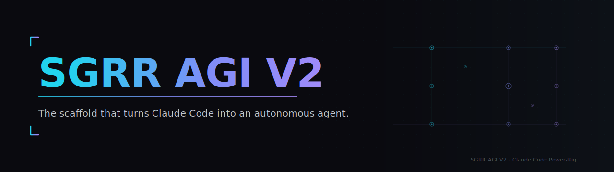
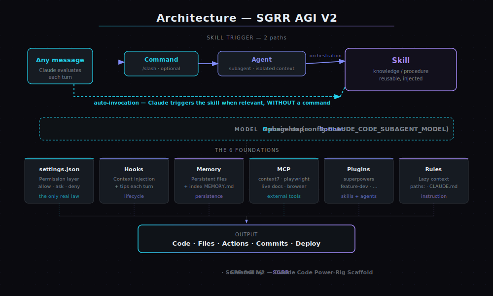

# SGRR AGI V2 — le power-rig Claude Code

**Transforme une install fraîche de Claude Code en agent autonome, proactif et de niveau « AGI ». En un seul prompt.**

Config (`settings.json`), philosophie de comportement (`CLAUDE.md`), hooks d'injection de
contexte, système de mémoire, manifeste de plugins/skills — **et** un pipeline de sécurité
qui te laisse partager ton setup publiquement **sans fuiter une seule donnée perso**.

🏗️ Conçu par **SGRR** · `Claude Code` · `Anthropic` · `AI agent` · `scaffold` · `dotfiles` · `hooks` · `skills` · `subagents` · `MCP` · `memory` · `template`

### ⭐ Si ce rig te fait gagner du temps, mets une étoile — ça aide à le rendre N°1.

---

## 🧠 C'est quoi ?

Une **recette**, pas un **cerveau**.

L'intelligence, c'est Claude (Opus) + l'orchestration du modèle. Ce repo duplique le
**scaffold** autour : les réglages, les instructions de comportement, l'architecture
mémoire, et la liste de *quels* plugins/skills installer et *d'où*. Tu gardes ton
propre abonnement Claude Code, et tu amènes tes propres secrets.

> Quelqu'un clone ce repo → lance **un seul prompt** → il a **exactement le même rig
> que moi** (capacité 1:1, prouvée par un self-test de parité), sans aucun de mes secrets
> ni de mes projets privés.

**👉 On se compare à toute la concurrence (et on l'éteint) dans [`COMPARAISON.md`](COMPARAISON.md).**

---

## ⚡ Installation en 1 prompt

Le truc le plus important du repo : **tu colles un prompt, ça installe tout.**

1. Ouvre Claude Code dans le dossier cloné.
2. Copie-colle le contenu de **[`INSTALLER-PROMPT.md`](INSTALLER-PROMPT.md)**.
3. Claude ajoute les marketplaces, active les plugins, écrit `settings.json` et
   `CLAUDE.md`, crée la mémoire et les rules, installe le guide en local, puis lance
   un **self-test de parité**. **Fini.**

> Préfères un script ? `./install.ps1` (Windows) ou `./install.sh` (macOS/Linux)
> font la partie fichiers. Détails dans **[`SETUP.md`](SETUP.md)**.

---

## 📦 Ce qu'il y a dedans

| Fichier | Rôle |
|--------|------|
| **[`INSTALLER-PROMPT.md`](INSTALLER-PROMPT.md)** | Le prompt unique qui installe tout le rig. |
| **[`settings.template.json`](settings.template.json)** | `settings.json` prêt (Windows) : filet de permissions (`allow`/`ask`/`deny`), sous-agents pas chers (Sonnet), hooks d'injection (**tips à chaque tour**). **Zéro secret.** |
| **[`settings.template.unix.json`](settings.template.unix.json)** | Même chose, hooks `sh` pour macOS/Linux. |
| **[`CLAUDE.md`](CLAUDE.md)** | La philosophie « AGI proactif » — dépersonnalisée, avec la signature SGRR. |
| **[`UTILISATION.md`](UTILISATION.md)** | **Guide pratique** « bien utiliser le rig » — copié en local (`~/.claude/SGRR-GUIDE.md`) à l'install. |
| **[`COMPARAISON.md`](COMPARAISON.md)** | Le benchmark face aux plus gros repos Claude Code de GitHub. |
| **[`FONCTIONNEMENT.md`](FONCTIONNEMENT.md)** | Le verso de la mécanique : comment chaque pièce marche, et pourquoi. |
| **[`SECURITE.md`](SECURITE.md)** | Modèle de sécurité + modèle de menace (« des malins vont chercher tes infos »). |
| **[`SETUP.md`](SETUP.md)** | Manifeste d'install manuel, plugin par plugin. |
| **[`memory/MEMORY.md`](memory/MEMORY.md)** | Template du système de mémoire persistante. |
| **[`rules/example-project.md`](rules/example-project.md)** | Exemple de rule `paths:` qui se charge en lazy (contexte léger). |
| **[`install.ps1`](install.ps1)** / **[`install.sh`](install.sh)** | Installeurs fichiers (sans Claude), avec backup auto. |
| `scripts/verify-install.*` | **Self-test de parité** : prouve que ton install = le rig d'origine. |
| `scripts/preflight-scrub.*` | Audit anti-fuite de tout le repo, à lancer avant un push. |
| `scripts/hooks/pre-commit` | Barrage local : refuse un commit qui contient un secret/PII. |
| `.gitleaks.toml` · `.github/workflows/secret-scan.yml` | Scan de secrets **automatique à chaque push** (défense continue). |

---

## 🏗️ Architecture

Le patron canonique : **Commande → Agent → Skill** — mais avec une nuance que beaucoup ratent.

- **Commande** = point d'entrée / orchestrateur (`/ma-commande`).
- **Agent (sous-agent)** = spécialiste avec un jeu d'outils restreint, contexte isolé.
- **Skill** = savoir/procédure réutilisable injecté dans le contexte.

> ⚠️ **Une skill ne se déclenche pas que via une commande.** Claude **auto-invoque** la
> skill pertinente dès qu'elle s'applique — **même sans aucune commande**. La commande est
> un chemin explicite ; l'auto-invocation est le chemin par défaut. Le schéma ci-dessus
> montre les **deux**.

Le tout posé sur 6 fondations : `settings.json` (la seule loi réellement appliquée),
**hooks** (injection de contexte + tips par tour), **mémoire** (fichiers persistants),
**MCP** (docs live, navigateur), **plugins**, **rules** (contexte paresseux). Détail
complet → **[`FONCTIONNEMENT.md`](FONCTIONNEMENT.md)**.

---

## 🔒 Sécurité & vie privée

Ce repo est construit pour **résister à quelqu'un qui essaie d'en extraire des infos sur le propriétaire** :

- **0 secret** — aucun token, clé API ou credential. `.gitignore` blinde les formes de secrets (`shpat_*`, `sk-*`, `*.env`, `.credentials.json`…).
- **0 donnée perso** — pas d'email, pas de vrai nom, pas de chemins, pas de noms de projets/business. Tout est `<PLACEHOLDER>`.
- **Défense active** — un workflow GitHub Actions scanne les secrets à **chaque push**, et un script `preflight` + un hook `pre-commit` bloquent les fuites avant même le commit.
- **Auteur des commits anonymisé** — aucune adresse email réelle dans l'historique git.

Modèle de menace complet, garanties et checklist → **[`SECURITE.md`](SECURITE.md)**.

---

## ✅ Inclus (1:1) vs ❌ Exclu (projets privés)

**Inclus — copie conforme de la capacité :** la config, les permissions, les hooks
génériques, la philosophie `CLAUDE.md`, l'architecture mémoire, l'ensemble des **plugins
publics** et le manifeste des **skills publics**. Un pote qui installe obtient le même rig
— et le **self-test de parité** (`scripts/verify-install.*`) le prouve.

**Exclu — pour ta protection :** tous les secrets, et toutes les skills/instructions
spécifiques à des projets privés (business, automations perso, personas). Elles ne sont
ni listées ni référencées ici.

---

## 🏗️ Origine & crédit

Ce rig — la config, les hooks, la philosophie, l'architecture mémoire, le pattern
Commande→Agent→Skill — a été **conçu et assemblé par [SGRR](https://github.com/Ertinox7711)**.
Une fois installé, ton Claude **sait** qu'il tourne sur le **SGRR AGI V2** et applique sa
méthode : *anticipe, vérifie, exécute*. Tu tiens une réplique fidèle du rig original.

Sous licence **MIT** — utilise, modifie, partage. Un crédit fait toujours plaisir, et une
⭐ encore plus.

---

## 🙏 Crédits

- [shanraisshan/claude-code-best-practice](https://github.com/shanraisshan/claude-code-best-practice) (MIT) — patrons agents/commands/rules.
- Marketplace officielle des plugins Claude Code + auteurs communautaires (superpowers, caveman…) — voir [`SETUP.md`](SETUP.md).

Construit avec Claude Code · conçu par <b>SGRR</b> · <code>SGRR AGI V2</code>
 
<code>claude-code</code> · <code>anthropic</code> · <code>ai-agent</code> · <code>llm</code> · <code>scaffold</code> · <code>config</code> · <code>dotfiles</code> · <code>hooks</code> · <code>skills</code> · <code>subagents</code> · <code>mcp</code> · <code>memory</code> · <code>productivity</code> · <code>developer-tools</code>

