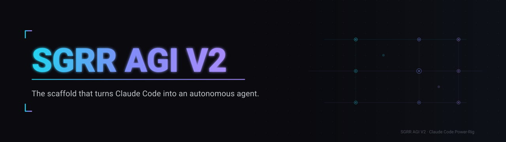
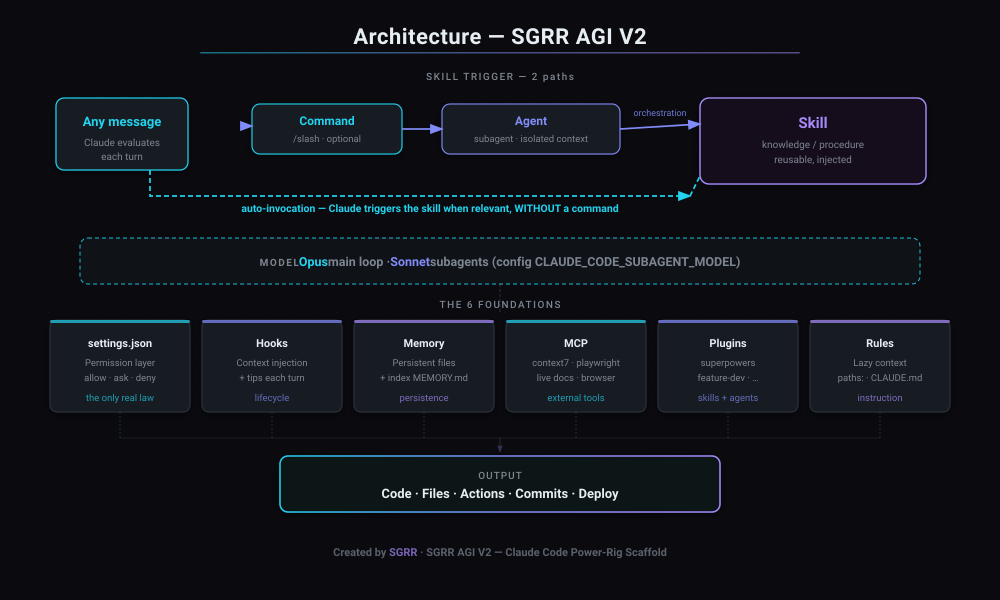

<div align="center">



# SGRR AGI V2 — the Claude Code power-rig

**Turn a fresh Claude Code install into an autonomous, proactive, "AGI"-grade agent. In one click.**

Config (`settings.json`), behavioral philosophy (`CLAUDE.md`), context-injection
hooks, a memory system, a plugin/skill manifest — **and** a security pipeline that
lets you share your setup **without leaking a single piece of personal data**.


<sub>🏗️ Designed by **SGRR** · `Claude Code` · `Anthropic` · `AI agent` · `scaffold` · `dotfiles` · `hooks` · `skills` · `subagents` · `MCP` · `memory` · `template`</sub>

</div>

---

# 👉 START HERE — you were sent this link

Three commands. Nothing else. It takes about two minutes.

```bash
git clone https://github.com/Ertinox7711/SGRR-AGI-V2.git sgrr-agi-v2
cd sgrr-agi-v2
```

**Windows** — double-click **`GO.bat`**, or:

```bash
powershell -NoProfile -ExecutionPolicy Bypass -File .\install.ps1
```

**macOS / Linux**:

```bash
./GO.sh
```

Then check it landed:

```bash
powershell -NoProfile -ExecutionPolicy Bypass -File .\scripts\verify-install.ps1
```

You want the last line to read **`FULL PARITY`**. On a clean machine that is
**29 OK / 2 WARN / 0 FAIL** — the two warnings are the two files only *you* can fill in,
and the installer tells you which.

**Then restart Claude Code and prove it actually changed something.** `FULL PARITY` means
the files landed; it does not mean your session loaded them. Two minutes, one paste:
[**`CHECK-IT-WORKED.md`**](CHECK-IT-WORKED.md) — a prompt that makes your Claude produce
*evidence* (a quoted line, a hook's real output, a command's real exit) instead of
reassurance, and tells you exactly what is missing if something is.

**Already using Claude Code?** Then don't run anything by hand — open Claude Code in the
cloned folder and paste [`INSTALLER-PROMPT.md`](INSTALLER-PROMPT.md) into it. It does the
install, the plugins, the personalisation and the self-test, and asks you the three
questions that depend on your machine.

### What this does to a setup you already have

It **merges**, it does not replace. Your own keys, plugins, permissions and hooks in
`~/.claude/settings.json` are kept; anything it overwrites with different content is
backed up next to it as `<file>.bak-<date>`. Nothing is uploaded, and no secret is read,
requested or stored. Want to look before it touches anything? `GO.bat /dry` (or
`./GO.sh --dry`) prints every action and writes nothing.

### If `git clone` says "repository not found"

It means the repo has gone back to private and your GitHub account is not on it. That 404
is GitHub hiding a private repo, not a broken link — ask the owner to add you as a
collaborator (the *Add people* box takes an email address, not only a username).

---

> ## 🔒 Clone it now — this repo is going back to private
>
> It is **temporarily public so one person can clone it**, and it flips back to private
> straight after. Plan accordingly: clone once, keep the folder.
>
> The reason it is normally private is the `formations/` folder, which holds **paid
> third-party course material**: transcripts of the Inner Circle and Ecom-Boss libraries,
> a Google Merchant Center playbook, a TikTok course. That content belongs to the people
> who sold it. It is here so the owner and one friend can work from it, and for no other
> purpose.
>
> - **Do not re-publish `formations/`, do not fork it outward.** The MIT licence below
>   covers the rig — the scaffold, the hooks, the skills, the docs. It does not cover, and
>   cannot cover, someone else's course.
> - Deleting those files later would not undo a republish: git history keeps them, and
>   GitHub caches and indexes what it has already served.
> - Everything outside `formations/` is still MIT and still leak-free: the security
>   pipeline described here was built for a public repo and has not been relaxed one inch.
>
> The star and fork badges that used to sit here were removed, since they render as broken
> images for as long as the repo is private.

---

## 🧠 What is it?

A **recipe**, not a **brain**.

The intelligence is Claude (Opus) + the model's orchestration. This repo duplicates
the **scaffold** around it: the settings, the behavioral instructions, the memory
architecture, and the list of *which* plugins/skills to install and *from where*.
You keep your own Claude Code subscription, and you bring your own secrets.

> Someone clones this repo → **double-clicks `GO.bat`** → they get **exactly the same
> rig I run** (1:1 capability, proven by a parity self-test), without any of my secrets
> or my private projects.

**👉 We benchmark against the whole field (and shut it down) in [`COMPARISON.md`](COMPARISON.md).**

---

## 🚀 Raw performance — what actually makes it fast

No fluff. The concrete levers that make this rig outrun a default Claude Code, in raw terms:

- **~5× cheaper sub-agents.** The main loop stays on **Opus** (max reasoning); every
  sub-agent (explorer, reviewer, translator…) can run on **Sonnet** via
  `CLAUDE_CODE_SUBAGENT_MODEL` — you pay Sonnet for grunt-work, Opus for decisions.
  Shipped **on** in the unix template; on Windows it is a deliberate one-line opt-in
  (`"env": {"CLAUDE_CODE_SUBAGENT_MODEL": "sonnet"}`), because an over-stuffed env is
  itself a known trap (see `PITFALLS.md` / *auth env*).
- **Parallelism is a reflex, not an afterthought.** `CLAUDE.md` forces independent tool
  calls into a **single message** — 5 reads at once instead of 5 round-trips. Same for
  sub-agents: independent work is dispatched together.
- **Lazy `paths:` rules instead of one bloated `CLAUDE.md`.** Per-project context loads
  **only** when you touch that project. 20 projects, zero overhead on a session that
  doesn't touch them. The context stays sharp, so the model stays fast.
- **Discipline enforced by hooks, not hope.** A `UserPromptSubmit` hook re-injects the
  rules (atomic commits, `tsc` before commit, verify-before-done) **every turn** — the
  model can't drift. No re-explaining, no wasted turns.
- **Real enforcement, not prose.** File edits flow through `acceptEdits` with zero
  friction, while dangerous work is intercepted *before* it runs. Two shapes, by platform:
  on **Windows**, 9 `PreToolUse` hooks that can **deny** outright (protected paths, asset
  deletion, store identity, destructive commands, browser navigation); on **macOS/Linux**,
  a `permissions.ask` net over the same command families (`rm`, `dd`, `mkfs`, `chmod`,
  `kill`, force-push, hard reset, `docker`, `kubectl`, `npm publish`…).
  Prose in `CLAUDE.md` is *not* enforced. These are.
- **It self-improves.** Two `SessionStart` hooks keep the rig current: one watches for
  new Claude Code releases, the other nudges you to run **`/rig-audit`** (below). The
  setup never goes stale — it gets *better* the longer you run it.

Full mechanics, with the traps 95% of people miss → **[`HOW-IT-WORKS.md`](HOW-IT-WORKS.md)**.

---

## ⚡ 1-click install

**Windows — double-click [`GO.bat`](GO.bat).**
**macOS — double-click [`GO.command`](GO.command).**  **Linux — `./GO.sh`.**

That's it. It installs the whole rig into `~/.claude`: `CLAUDE.md`, `PITFALLS.md`, the
memory, **132 skills**, **20 commands**, **9 lazy rules**, **6 agents**, **24 hook
scripts**, the docs, and the store / Shopify operating manuals. Your `settings.json` is
**smart-merged, never clobbered** — your keys, plugins, permissions and your own hooks
survive; re-running is idempotent; anything overwritten with *different* content is
backed up as `<file>.bak-<timestamp>`.

```bash
GO.bat /dry       # Windows: show what would happen, write nothing
./GO.sh --dry-run # macOS / Linux: same
GO.bat /minimal   # core only, skip skills/ docs/ shops/ shopify/
```

Two things are left, and both live **inside** Claude Code (a script cannot do them):

1. `/plugin marketplace add JuliusBrussee/caveman`, then enable the plugins in `SETUP.md`.
2. Restart Claude Code and run **`/session-check`** — a GO/NO-GO verdict that the rig is
   actually **live this session**, not merely on disk.

> **Prefer to have Claude do it?** Open Claude Code in the cloned folder and paste
> **[`INSTALLER-PROMPT.md`](INSTALLER-PROMPT.md)** — it adds the marketplaces, enables the
> plugins, runs the installer and finishes with the parity self-test.
> Manual, piece by piece → **[`SETUP.md`](SETUP.md)**.

### After the install — 3 files to personalise

| File | Why |
|---|---|
| `~/.claude/protected-zones.json` | Names **your** read-only / write-protected folders. The `PreToolUse` gate reads it and physically blocks writes there. Ships with placeholders — **edit it or the gate protects nothing**. |
| `~/.claude/shops-registry.md` | Only if you run stores/tenants: one line per store. The identity hooks derive everything else from it. |
| `~/.claude/CLAUDE.md` | Fill the `<PLACEHOLDER>`s. |

---

## 📦 What's inside

### The payload — what lands in `~/.claude`

| Folder | Count | What it is |
|---|---|---|
| `skills/` | **132** | The full skill library: session readiness, shop operations, product research, Liquid/theme work, design systems, browser automation, research, writing, the `gstack` toolchain… Auto-invoked the moment one applies. |
| `commands/` | **20** | `/session-check`, `/rig-audit`, `/shop`, `/pitfall`, `/scrape403`, `/brain`, `/cmds`, `/matin`, the workflow commands… |
| `rules/` | **9** | Lazy `paths:` rules — per-project context that loads **only** when you touch that project. |
| `agents/` | **6** | Sub-agent definitions (restricted toolsets, isolated context). |
| `scripts/` | **24** | The hook scripts behind the gates + the parity self-test, the preflight scrub, the registry sync. |
| `docs/` | 1 | The external skill-library index (name → path → one-liner), the reflex described in `CLAUDE.md`. |
| `shops/` | — | [`GO-SHOPS.md`](shops/GO-SHOPS.md): the **multi-store operating manual** — folder-derived identity, the registry, the three protection layers, the shared store skeleton, plus a ready-to-copy `scaffold/`. |
| `shopify/` | — | [`GO-SHOPIFY.md`](shopify/GO-SHOPIFY.md): the **Shopify operating manual** — reference-site cloning, product validation economics, the scoring grid, the 9 discovery methods, Google Ads structure, copy/CRO, Liquid wiring, the API traps, the pre-ads gates. |
| `formations/` | **341** | 🔒 **The training libraries** — course transcripts, the GMC playbook, the TikTok course, the owner's own HTML formation, plus three paste-ready `bundles/`. **Paid third-party material: private, not redistributable.** Read [`formations/README.md`](formations/README.md) first; the 3.36 GB of audio is out of git and inventoried in [`AUDIO-MANIFEST.md`](formations/AUDIO-MANIFEST.md). |

**12 hooks are wired by the install** — 3 `SessionStart` (update watch, rig-audit nudge,
store-token freshness) and 9 `PreToolUse` gates (protected paths, asset deletion, store
identity ×2, destructive commands, browser navigation denylist, pitfall coaching ×2,
sub-agent fan-out cap).

### The files at the root

| File | Role |
|------|------|
| **[`GO.bat`](GO.bat)** / **[`GO.command`](GO.command)** / **[`GO.sh`](GO.sh)** | **The 1-click entry point.** Double-click and the rig is installed. |
| **[`INSTALLER-PROMPT.md`](INSTALLER-PROMPT.md)** | The single prompt that installs the whole rig from inside Claude Code. |
| **[`protected-zones.example.json`](protected-zones.example.json)** | Template for the write-gate config. Copied to `~/.claude/protected-zones.json` at install — **edit it**. |
| **[`settings.optional-hooks.json`](settings.optional-hooks.json)** | Machine-specific hooks (local bridges, WSL digests) kept **out** of the default install, documented so you can opt in. |
| **[`settings.template.json`](settings.template.json)** | Ready `settings.json` (Windows): permission net (`allow`/`ask`/`deny`), cheap sub-agents (Sonnet), injection hooks (**tips every turn**). **Zero secrets.** |
| **[`settings.template.unix.json`](settings.template.unix.json)** | Same thing, `sh` hooks for macOS/Linux. |
| **[`CLAUDE.md`](CLAUDE.md)** | The "proactive AGI" philosophy — depersonalized, with the SGRR signature. |
| **[`USAGE.md`](USAGE.md)** | **Practical guide** to using the rig well — copied locally (`~/.claude/SGRR-GUIDE.md`) at install. |
| **[`PITFALLS.md`](PITFALLS.md)** | **13 hard-won traps** the rig refuses to repeat — each a universal rule, surfaced *live* by a `PreToolUse` hook the moment a risky command matches. |
| **[`COMPARISON.md`](COMPARISON.md)** | The benchmark against the biggest Claude Code repos on GitHub. |
| **[`HOW-IT-WORKS.md`](HOW-IT-WORKS.md)** | The back of the machine: how each piece works, and why. |
| **[`SECURITY.md`](SECURITY.md)** | Security model + threat model ("people will dig for your info"). |
| **[`SETUP.md`](SETUP.md)** | Manual install manifest, plugin by plugin. |
| **[`memory/MEMORY.md`](memory/MEMORY.md)** | Template for the persistent memory system. |
| **[`rules/example-project.md`](rules/example-project.md)** | Example `paths:` rule that loads lazily (light context). |
| **[`commands/rig-audit.md`](commands/rig-audit.md)** | The **`/rig-audit`** command: analyzes all your sessions + project folders and proposes concrete upgrades to the rig. **Report-only.** |
| **[`commands/session-check.md`](commands/session-check.md)** + **[`skills/session-check/SKILL.md`](skills/session-check/SKILL.md)** | The **`/session-check`** command **and** auto-firing skill: a GO/NO-GO readiness verdict — confirms you're in the right repo/dir **and** the rig + superpowers + skills are **loaded this session**, not just installed on disk. |
| **[`install.ps1`](install.ps1)** / **[`install.sh`](install.sh)** | File installers (no Claude), with auto-backup. |
| `scripts/verify-install.*` | **Parity self-test**: proves your install = the original rig. |
| `scripts/check-cc-updates.*` | **Claude Code update watch**: a `SessionStart` hook that spots every new version, tells you, and proposes adoptions — one half of the **self-improvement loop**. |
| `scripts/rig-audit-nudge.*` | Periodic `SessionStart` nudge (every 7 days) reminding you to run `/rig-audit` — the other half of the loop. |
| `scripts/pitfall-tips.*` | `PreToolUse` coach: matches a command against known traps and injects the matching **PITFALLS** lesson before it runs (advice only). |
| `scripts/preflight-scrub.*` | Anti-leak audit of the whole repo, to run before a push. |
| `scripts/hooks/pre-commit` | Local barrier: rejects a commit that contains a secret/PII. |
| `.gitleaks.toml` · `.github/workflows/secret-scan.yml` | **Automatic secret scan on every push** (continuous defense). |

---

## 💾 How the memory works

Files, not a database. The whole point is that it's **versionable, human-readable,
hand-editable, and dependency-free**.

- **`~/.claude/memory/` holds one file per fact**, plus a `MEMORY.md` **index** that's
  loaded into context at **every session**. The index is one line per memory — never the
  content — so it stays cheap to load.
- **Each memory file has frontmatter**: `name` (kebab-case slug), `description` (the
  one-liner used to judge relevance at recall time), and `metadata.type`.
- **Four types**, each with a clear job:
  `user` (who you are), `feedback` (how you want the agent to work — with the *why*),
  `project` (facts not derivable from code or git), `reference` (URLs, dashboards, tickets).
- **Hooks drive it both ways.** `SessionStart` reminds Claude to **read** `MEMORY.md`;
  `PreCompact` reminds it to **write** durable facts before the context is compressed and lost.
- **The golden rule: save only the non-derivable.** Never store what the repo already
  knows (code structure, git log, conventions). One fact per file, and only if it can't
  be re-derived. That discipline is what keeps the signal from drowning in noise.

Deep dive → **[`HOW-IT-WORKS.md`](HOW-IT-WORKS.md)** (section 3).

---

## 🏗️ Architecture

<div align="center">

</div>

The canonical pattern: **Command → Agent → Skill** — but with a nuance most people miss.

- **Command** = entry point / orchestrator (`/my-command`).
- **Agent (sub-agent)** = specialist with a restricted toolset, isolated context.
- **Skill** = reusable knowledge/procedure injected into context.

> ⚠️ **A skill doesn't only fire through a command.** Claude **auto-invokes** the relevant
> skill the moment it applies — **even with no command at all**. The command is the explicit
> path; auto-invocation is the default path. The diagram above shows **both**.

It all sits on 6 foundations: `settings.json` (the only law actually enforced),
**hooks** (context injection + tips per turn + **self-improvement** watchers),
**memory** (persistent files),
**MCP** (live docs, browser), **plugins**, **rules** (lazy context). Full detail
→ **[`HOW-IT-WORKS.md`](HOW-IT-WORKS.md)**.

---

## 🔄 A rig that improves itself

Most setups freeze the day you write them and rot from there. This one has a built-in
self-improvement loop, in two halves:

- **Update watch** (`scripts/check-cc-updates.*`) — a `SessionStart` hook (throttled to
  one network call / 12h) that detects every new Claude Code release, has you read the
  changelog, and **proposes** what the rig should adopt. Never more than one version behind.
- **`/rig-audit`** (`commands/rig-audit.md`) — on demand, it analyzes **all your sessions
  and project folders**, cross-references them against what the rig currently provides, and
  outputs a **prioritized proposal** of upgrades (missing rules, memory to persist, commands
  worth creating, settings drift, hook opportunities). It's **report-only** — it changes
  nothing until you pick the items. A `SessionStart` nudge (`scripts/rig-audit-nudge.*`,
  every 7 days) reminds you it exists. **No personal data ever leaves your machine.**

---

## 🧨 A rig that learns from mistakes

A self-improving rig isn't only about *new* features — it's about never re-paying for
*old* mistakes. **[`PITFALLS.md`](PITFALLS.md)** is the institutional memory of a
power-user: **13 traps** (mock drift, blind commits, secret leaks, the `--no-verify`
bypass, destructive ops with no backup, prompt-injection via config…), each generalized
to a universal rule — **symptom → rule → cheap check**.

They don't sit in a file you'll forget. A **`PreToolUse` hook** (`scripts/pitfall-tips.*`)
watches what you're about to run and **injects the matching lesson before the command
executes** — destructive matches every time, coaching tips throttled so they nudge without
nagging. The hook only ever *advises*; blocking stays the job of `permissions.ask`. The
condensed list also rides in `CLAUDE.md`, loaded every session.

---

## 🔒 Security & privacy

This repo is built to **withstand someone trying to extract info about its owner**:

- **0 secrets** — no token, API key, or credential. `.gitignore` hard-blocks secret shapes (`shpat_*`, `sk-*`, `*.env`, `.credentials.json`…).
- **0 personal data** — no email, no real name, no paths, no project/business names. Everything is a `<PLACEHOLDER>`.
- **Active defense** — a GitHub Actions workflow scans for secrets on **every push**, and a `preflight` script + a `pre-commit` hook block leaks before the commit even happens.
- **Anonymized commit author** — no real email address anywhere in the git history.

Full threat model, guarantees, and checklist → **[`SECURITY.md`](SECURITY.md)**.

---

## ✅ Included (1:1) vs ❌ Excluded (private projects)

**Included — a faithful copy of the capability:** the config, the permissions, all 12
hooks, the `CLAUDE.md` philosophy, the memory architecture, every public plugin, and the
**whole working payload** — 132 skills, 20 commands, 9 rules, 6 agents, 24 scripts, the
store and Shopify operating manuals. A friend who installs it gets the same rig — and the
**parity self-test** (`scripts/verify-install.*`) proves it.

**Excluded — deliberately, and here is the exact list:**

| What | Why |
|---|---|
| Every secret, token, credential | Obvious. `.gitignore` blocks the shapes, the CI scans every push. |
| Real folder names, store names, handles, domains, account ids, chat ids, emails | Replaced by `SHOP-A/B/C`, `<PLACEHOLDER>`, `<REDACTED_TOKEN>`. The mechanism ships; the identity does not. |
| 12 skills + 3 rules + 1 session journal tied to private business workflows | They named third parties, personas, and a partner's real data. Not mine to publish. The last one removed was a store master-skill that carried a **supplier's contact address**, validated margin figures, and — through a throwaway "brand = X + Y" note — the derivation of the anonymised store's real name. Anonymising a file is not enough if one line lets you rebuild the name. |
| The **verbatim transcripts of paid third-party courses** | Redistributing them would be infringement no matter who paid. The **method** distilled from them ships in full (`shopify/GO-SHOPIFY.md`); a loader (`shopify/formations/load-formations.ps1`) reads **your own local copies** if you own them, and writes the bundle **outside** any git repo so it can never be committed by accident. |

Nothing excluded is referenced, indexed, or reconstructible from what's here.

---

## 🏗️ Origin & credit

This rig — the config, the hooks, the philosophy, the memory architecture, the
Command→Agent→Skill pattern — was **designed and assembled by [SGRR](https://github.com/Ertinox7711)**.
Once installed, your Claude **knows** it runs on the **SGRR AGI V2** and applies its method:
*anticipate, verify, execute*. You hold a faithful replica of the original rig.

Licensed under **MIT** — use it, modify it, share it. Credit is always appreciated, and a
⭐ even more.

<div align="center">
<sub>Built with Claude Code · designed by <b>SGRR</b> · <code>SGRR AGI V2</code></sub>
<br/>
<sub><code>claude-code</code> · <code>anthropic</code> · <code>ai-agent</code> · <code>llm</code> · <code>scaffold</code> · <code>config</code> · <code>dotfiles</code> · <code>hooks</code> · <code>skills</code> · <code>subagents</code> · <code>mcp</code> · <code>memory</code> · <code>productivity</code> · <code>developer-tools</code></sub>
</div>
